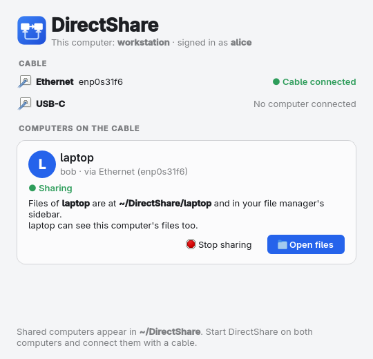
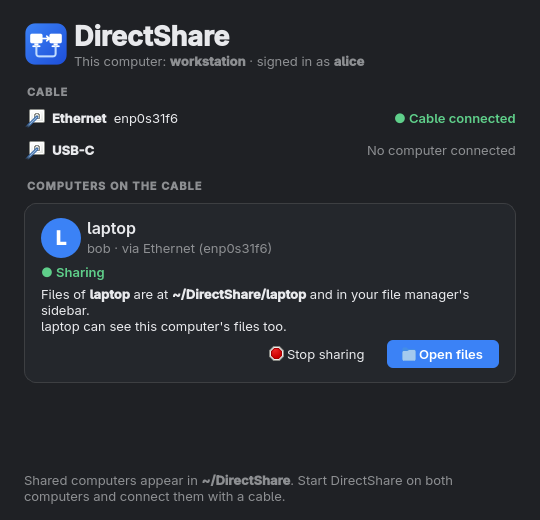
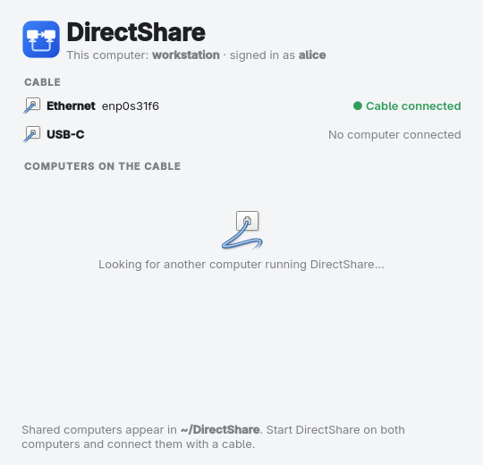
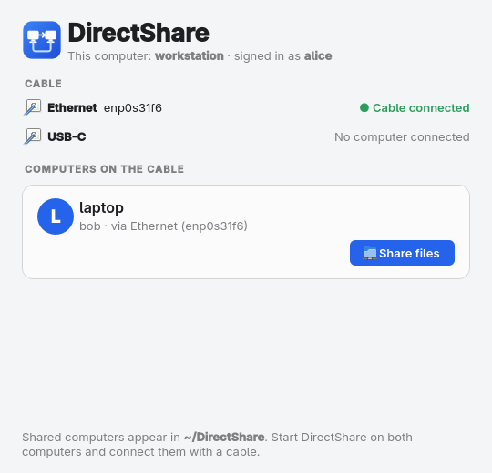
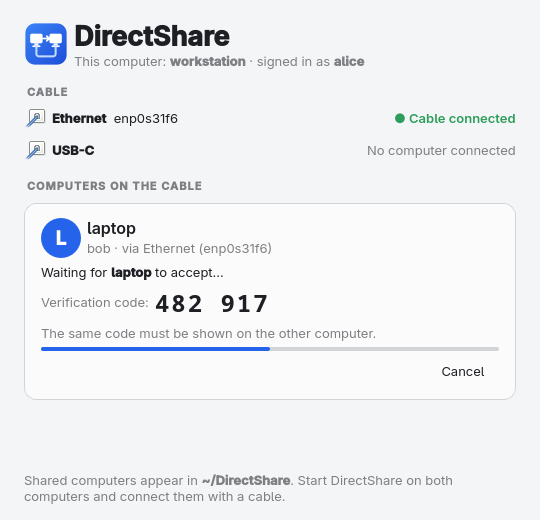
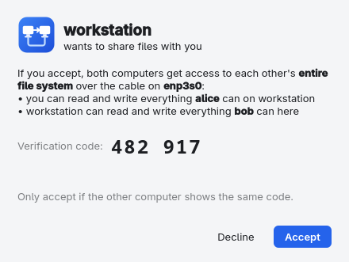
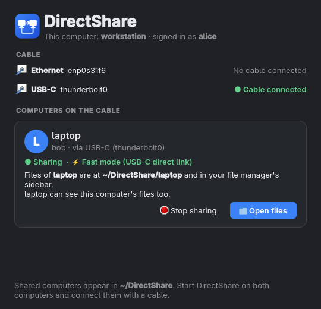
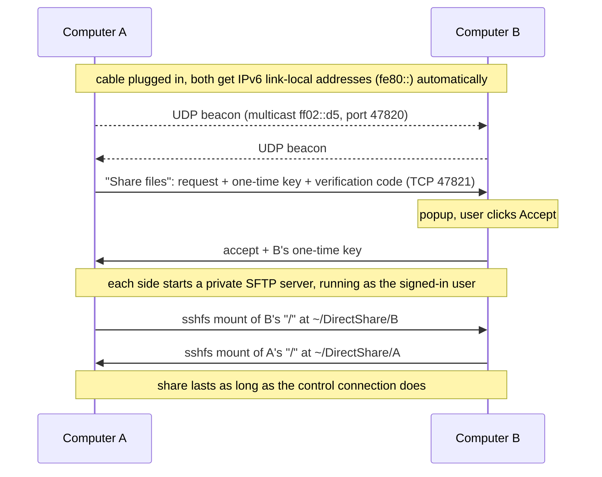

<p align="center">
  
</p>

<h1 align="center">DirectShare</h1>

<p align="center">
  <b>Plug in a cable, click once, and two Linux computers can see each other's files.</b><br>
  No router, no IP addresses, no passwords, no server setup.
</p>

<p align="center">
  
  
</p>

---

## How it works for you

1. Start **DirectShare** on both computers.
2. Connect them directly with an **Ethernet cable**, or with a **USB-C cable** if both have
   USB4/Thunderbolt ports. That's [~4x faster](#usb-c--thunderbolt-fast-mode). No switch or router needed.
3. On one computer, click **Share files**.
4. The other computer shows a popup. Check that both screens show the same code, then click **Accept**.
5. Each computer now has the other one's **entire file system** mounted at `~/DirectShare/<other-computer>`.
   It also shows up in the file manager's sidebar, and every program can use it like a local folder.

You get the same access as the user signed in on the other computer: whatever they can read or
change, you can read or change, and nothing more. Click **Stop sharing**, close the app or unplug
the cable, and both sides unmount right away.

| Looking for a peer | Peer found | Waiting for the other side |
|:---:|:---:|:---:|
|  |  |  |

| The popup on the other computer | USB-C fast mode (dark theme) |
|:---:|:---:|
|  |  |

## Installation

```bash
git clone https://github.com/KsmBl/directshare.git
cd directshare
./install.sh            # installs for your user into ~/.local and offers to install missing packages
```

`./install.sh --system` installs for all users into `/usr/local` (uses sudo). `./install.sh --no-deps`
skips the dependency check.

### Dependencies

| What | Arch | Debian / Ubuntu | Fedora |
|---|---|---|---|
| OpenSSH server binary (`sshd`) | `openssh` | `openssh-server` | `openssh-server` |
| sshfs + FUSE 3 | `sshfs` | `sshfs` | `fuse-sshfs` |
| PyQt6 + Qt SVG | `python-pyqt6 qt6-svg` | `python3-pyqt6 libqt6svg6` | `python3-pyqt6 qt6-qtsvg` |
| iproute2 | `iproute2` | `iproute2` | `iproute` |

DirectShare only uses the `sshd` **program**. It never enables or reconfigures the system SSH
service, and it doesn't need root.

You can also run it straight from the source folder without installing it: `python3 -m directshare`.

### Uninstall

```bash
./uninstall.sh            # remove the program
./uninstall.sh --purge    # also remove the host key, network profiles and sidebar bookmarks
```

Add `--system` if you installed with `--system`.

## How it works inside



- **No network setup.** Every Linux machine gives a cabled interface an IPv6 link-local address
  (`fe80::…`) as soon as the cable is plugged in, without DHCP. DirectShare finds the other machine
  with link-local multicast and connects over those addresses. Nothing is routed, so nothing leaves
  the cable.
- **Exactly the remote user's permissions.** Each computer starts its own `sshd` **as the signed-in
  user** (not as root), so the peer can do exactly what that user can do. A normal user can't read
  `/root`, so neither can the peer.
- **Works with every file manager.** The share is a regular FUSE mount (`sshfs`) inside your home
  folder: Nautilus, Dolphin, Thunar, Nemo, PCManFM, terminal tools and file dialogs all see it.
  GTK file managers also get a sidebar bookmark.
- **Why SFTP instead of SMB?** The share behaves like a mounted network share, but a Samba server
  needs root, a user/password database and system configuration, and mounting SMB needs root or
  gvfs (which Dolphin, for example, doesn't use). SFTP can run fully unprivileged, uses one-time keys
  instead of passwords, and gives exactly the signed-in user's permissions.

### Security

- Nothing happens until a person on the other computer clicks **Accept**, and **Decline** has the
  keyboard focus so a stray Enter doesn't share your disk.
- Both screens show a 6-digit **verification code** derived from the requester's one-time key.
- Each session uses fresh ed25519 keys. Password login is disabled, the servers only speak SFTP
  (no shell, no port forwarding), only accept the one key from this session, and only listen on the
  cable's link-local address. Host keys are pinned during the handshake, so there's no
  "trust this host?" prompt to click through.
- The control port only answers peers on a wired interface's link-local network. Requests from
  Wi-Fi or routed networks are dropped.
- Everything ends when the session ends: keys are deleted, servers stopped, mounts removed.
- Over USB-C/Thunderbolt the transfer isn't encrypted, for speed. See
  [fast mode](#usb-c--thunderbolt-fast-mode) for why that's safe on a point-to-point link.

## Troubleshooting

| Problem | Fix |
|---|---|
| "Cable connected, waiting for address…" doesn't go away | Click **Set up link**. It creates a private NetworkManager profile `DirectShare <iface>` that uses link-local addresses and doesn't wait for DHCP. |
| The other computer never shows up | A firewall is probably blocking it. Allow the cable interface, e.g. `sudo ufw allow in on enp3s0` or `sudo firewall-cmd --zone=trusted --change-interface=enp3s0`. Ports used: UDP 47820, TCP 47821–47831. |
| Wi-Fi turns off when the cable is plugged in | That's not DirectShare, it's usually TLP (`DEVICES_TO_DISABLE_ON_LAN_CONNECT`), a BIOS "LAN/WLAN switching" option or a NetworkManager dispatcher script. On Dell laptops it's the BIOS option "Control WLAN radio", which you can turn off from Linux: `echo Disabled \| sudo tee /sys/class/firmware-attributes/dell-wmi-sysman/attributes/WlanAutoSense/current_value`, then reboot. Run `tools/diagnose-wifi-drop.sh`: it checks the usual causes, watches what happens when you plug in the cable and names the culprit. |
| IPv6 is disabled | DirectShare needs IPv6 on the cable interface: `sudo sysctl net.ipv6.conf.<iface>.disable_ipv6=0`. |
| A folder in `~/DirectShare` says "Transport endpoint is not connected" | A crashed session left a stale mount. Starting DirectShare again cleans it up, or run `fusermount3 -uz ~/DirectShare/<name>`. |
| Old network card without auto MDI-X | Very old 100 Mbit cards need a crossover cable. Anything from the last 15 years works with a normal cable. |

Logs of the file server for a running session are in `$XDG_RUNTIME_DIR/directshare/session-*/sshd.log`.

## USB-C / Thunderbolt fast mode

If **both** computers have USB4 or Thunderbolt 3/4 ports, connect them with a USB-C cable.
The kernel's `thunderbolt-net` driver turns the cable into a network link (`thunderbolt0`),
DirectShare shows it as **USB-C**, and the share runs in **fast mode**.

Over Ethernet the 1 Gbit/s cable is the limit (~115 MB/s). A Thunderbolt link carries
20–40 Gbit/s, so there SSH encryption becomes the bottleneck. Fast mode skips it. Measured
between two network namespaces on an i7-13850HX, reading and writing a 3 GB file through the mount:

| Transport | Read | Write |
|---|---:|---:|
| SSH, OpenSSH default cipher (chacha20) | 491 MB/s | 640 MB/s |
| SSH, AES-128-GCM (what DirectShare uses over Ethernet) | 854 MB/s | 773 MB/s |
| **Fast mode** (USB-C) | **~2000 MB/s** | **~1400 MB/s** |

How fast mode stays safe without encryption:

- It's only used when **both** sides see the link as USB-C. A Thunderbolt link connects exactly two
  computers, so there's nobody in between to listen. Over Ethernet (which could go through a
  switch) DirectShare always uses SSH. A peer can't talk the other side into fast mode, because each
  side checks its own link type.
- The file server only accepts connections from the peer's address on that cable, and the peer has
  to present a random **256-bit one-time token** sent over the handshake. Other users logged into
  the peer computer don't have the token, so they get nothing.
- After the token check the socket is handed straight to `sftp-server` on one side and to `sshfs`
  on the other. No process copies the data in between.
- Access rights are the same as in SSH mode: the server runs as the signed-in user.

**Requirements:** USB4 or Thunderbolt 3/4 ports on both computers (check with
`ls /sys/bus/thunderbolt/devices`: you need a `domain0`), a USB4/Thunderbolt-rated USB-C cable
(a USB 2.0 charging cable won't do), and a kernel with `thunderbolt_net`, which every
mainstream distribution has. Plain USB-C ports without USB4/Thunderbolt can't connect two computers.

**If the USB-C row stays at "No computer connected"** after plugging in: check that the cable is a
data cable, try `sudo modprobe thunderbolt_net`, and look at `dmesg | grep -i thunderbolt`.
Some BIOSes have a "Thunderbolt security level" or "Thunderbolt networking" setting. Host-to-host
networking needs it allowed.

## Development

```
directshare/
  links.py       cable detection (LinkProvider per cable type) and link setup via NetworkManager
  discovery.py   link-local multicast beacons
  engine.py      control protocol and session lifecycle
  sharing.py     unprivileged sshd, sshfs mounts, file manager bookmarks
  gui.py         Qt interface
tests/
  e2e_netns.sh   end-to-end test: two instances in two network namespaces joined by a virtual cable
  test_unit.py   unit tests: fast-mode access control, cable detection
tools/
  screenshots.py renders the README screenshots offscreen
```

Unit tests:

```bash
python3 -m unittest discover -s tests
```

Run the end-to-end test. It needs sudo only to create the network namespaces, and it covers
accept, decline, USB-C fast mode, the fallback to SSH and a pulled cable:

```bash
tests/e2e_netns.sh
```

Regenerate the screenshots:

```bash
python3 tools/screenshots.py && python3 tools/screenshots.py --dark
```

`DIRECTSHARE_HOME=<dir>` moves all state and mounts into `<dir>`, and `DIRECTSHARE_IFACES=if1,if2:usb-c`
picks the interfaces to use and optionally their cable type. Both are meant for testing.

## License

[MIT](LICENSE)
